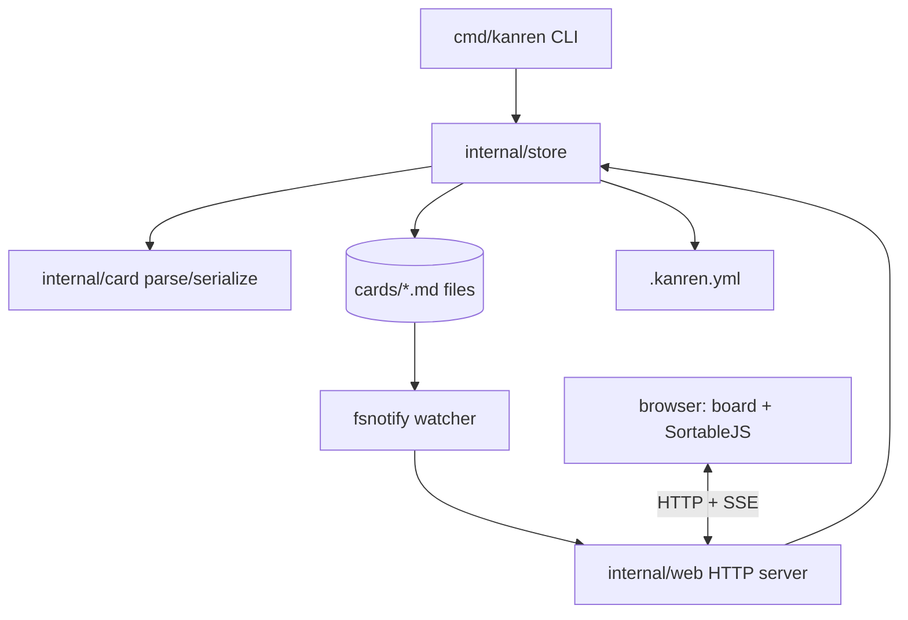

# kanren Core — Design

**Spec**: `.specs/features/core/spec.md`
**Status**: Draft

---

## Architecture Overview

One store, two editors, no DB. Everything funnels through a single `store` package that owns all file read/write. CLI and web server are thin adapters over it — that is the guarantee they never diverge (WEB-04).



Rule: **no file I/O outside `internal/store`.** CLI/web call store methods only. Card package is pure (bytes in, struct out, bytes back) — trivially testable, the heart of round-trip correctness (CARD-02).

---

## Approaches Considered

**A — Store-centric, pure card package (RECOMMENDED).**
`card` = pure parse/serialize, zero I/O. `store` = all filesystem ops + id allocation + config. CLI and web are adapters. Web frontend is no-build vanilla JS + embedded SortableJS, live-reload via SSE + fsnotify.
_Pro:_ Round-trip logic isolated and pure = easy tests + easy Go teaching. Single I/O owner = one place conflicts/validation live. No npm, no build step.
_Con:_ SSE + fsnotify is new territory (mitigated: tiny surface, P1 story WEB-03).

**B — Fat card package (card does its own file I/O).**
_Pro:_ fewer packages.
_Con:_ I/O scattered, hard to test purely, validation duplicated between CLI/web. Rejected.

**C — SQLite index cache alongside files.**
Files stay source of truth; a SQLite cache speeds queries.
_Pro:_ fast queries at scale.
_Con:_ two sources of truth = the exact divergence we promised to avoid; cache invalidation on `git pull`. Over-engineered for MVP (boards are dozens–hundreds of cards, linear scan is fine). Rejected for MVP; revisit only if perf demands.

**Chosen: A.** Confirm before Tasks.

---

## Code Reuse Analysis

### Existing (scaffold)

| Component              | Location                | How to Use                                         |
| ---------------------- | ----------------------- | -------------------------------------------------- |
| `card.Card` struct     | `internal/card/card.go` | Extend: add parse/serialize; already has yaml tags |
| `main.go` arg dispatch | `cmd/kanren/main.go`    | Replace stub with subcommand router                |
| CI/Makefile            | root                    | Already gates every task — no change               |

### New dependencies (grounded via Context7)

| Lib                                             | Why                                 | Note                                                                                                                       |
| ----------------------------------------------- | ----------------------------------- | -------------------------------------------------------------------------------------------------------------------------- |
| `github.com/goccy/go-yaml`                      | Frontmatter parse/serialize         | **Marshal preserves struct field order** → deterministic diffs (verified Context7). Better errors than yaml.v3 (archived). |
| `github.com/fsnotify/fsnotify`                  | Watch `cards/` for WEB-03           | De-facto standard, cross-platform                                                                                          |
| SortableJS (vendored JS file, ~in `web/` embed) | Drag-drop in browser, no build step | Single file, MIT, embedded via `embed.FS`                                                                                  |

Stdlib for the rest: `net/http` (server), `embed` (ship UI in binary), `flag` (CLI), `encoding/json` (QRY-02).

---

## Components

### `internal/card` — pure card codec

- **Purpose**: Convert card file bytes ↔ `Card` struct. No I/O.
- **Interfaces**:
  - `Parse(data []byte) (Card, error)` — split first `---`…`---` frontmatter block, yaml-unmarshal it, rest = Body. Errors name the reason (CARD-03).
  - `(c Card) Marshal() ([]byte, error)` — frontmatter (fixed field order) + `\n` + Body.
  - `Slugify(title string) string` — filename-safe slug (CARD-01).
- **Invariant**: `Parse(Marshal(c)) == c` for valid input (CARD-02). This is the headline test.

### `internal/store` — the single I/O owner

- **Purpose**: All filesystem ops, id allocation, config, validation, query.
- **Interfaces**:
  - `Open(dir string) (*Store, error)` — load `.kanren.yml`, index cards; error if config missing (tells user to `init`).
  - `Init(dir string) error` — scaffold config + `cards/` (INIT-01/02).
  - `Add(title string) (Card, error)` — next id, leftmost column, write file (CLI-01).
  - `Move(id int, status string) error` — validate status ∈ columns, edit only `status`/`order`, body byte-identical (CLI-02).
  - `List(filter Filter) ([]Card, error)` — AND-filter by status/tag/assignee (QRY-01, CLI-03).
  - `Get(id int) (Card, error)`, `Save(Card) error`.
  - `Columns() []string`.
- **Dependencies**: `card`, `os`, config.
- **Validation**: duplicate id, misfiled status (CARD-04), malformed file skipped-with-report (CARD-03).

### `internal/web` — board server

- **Purpose**: Serve board UI + JSON API over the store; live-reload.
- **Interfaces**:
  - `Serve(s *Store, port int) error`
  - `GET /` → HTML board (columns from `s.Columns()`, cards rendered)
  - `GET /api/cards` → JSON (reuses `store.List`)
  - `POST /api/cards/{id}/move` → `store.Move` (WEB-02)
  - `GET /events` → SSE stream; fsnotify on `cards/` pushes reload (WEB-03)
- **Reuses**: `store` for every mutation → guarantees WEB-04 (files identical to CLI).

### `cmd/kanren` — CLI router

- **Purpose**: Parse subcommand + flags, call store, print/format.
- **Commands**: `init`, `add`, `ls` (+ `--status/--tag/--assignee/--json`), `mv`, `edit`, `serve`, `version`.

---

## Data Models

### Card file — `cards/NNNN-slug.md`

```markdown
---
id: 12
title: Fix auth token expiry
status: doing
tags:
  - bug
  - urgent
assignee: vitorqf
created: 2026-07-12
order: 2
---

# Fix auth token expiry

Check uses `<` not `<=`.
```

### `.kanren.yml` (board root)

```yaml
columns:
  - todo
  - doing
  - done
cards_dir: cards
```

### `Filter` (query)

```go
type Filter struct {
    Status   string   // "" = any
    Tag      string   // "" = any
    Assignee string   // "" = any
}
```

---

## Error Handling Strategy

| Scenario                 | Handling                                | User sees                                                      |
| ------------------------ | --------------------------------------- | -------------------------------------------------------------- |
| Malformed frontmatter    | Skip that file, collect error           | Warning naming file+reason; other cards still listed (CARD-03) |
| status ∉ columns         | Card flagged "misfiled", not moved      | Listed under a `⚠ misfiled` group (CARD-04)                    |
| `mv` bad id / status     | No file change, exit nonzero            | Clear message (CLI-04)                                         |
| Duplicate id             | Refuse id-based ops                     | Names both files (edge case)                                   |
| `.kanren.yml` missing    | Refuse                                  | "run `kanren init`"                                            |
| Port taken (`serve`)     | Fail clear; try next port (assumption)  | Message with chosen/failed port                                |
| Concurrent CLI+web write | Last-write-wins; fsnotify reloads board | No lock; single-user (assumption)                              |

---

## Risks & Concerns

| Concern                                                                   | Location         | Impact                                                 | Mitigation                                                                                                                      |
| ------------------------------------------------------------------------- | ---------------- | ------------------------------------------------------ | ------------------------------------------------------------------------------------------------------------------------------- |
| Round-trip must be byte-stable or every `mv` churns the whole file in git | `internal/card`  | Noisy diffs kill the "clean git history" selling point | goccy Marshal preserves field order (verified); golden-file test asserts `mv` touches only `status`/`order` lines (CLI-02 test) |
| fsnotify + SSE new pattern for us                                         | `internal/web`   | Live-reload flaky                                      | Small surface; fallback = poll every 2s if watcher unavailable                                                                  |
| No file locking on concurrent write                                       | `internal/store` | Lost write if CLI + web save same card same instant    | Accepted (single-user, out-of-scope auto-merge); document; git catches divergence                                               |
| YAML lib re-quotes/reformats scalars on save                              | `internal/card`  | Body/title reformat churn                              | Golden-file round-trip test on realistic cards; pin lib version                                                                 |

---

## Tech Decisions

| Decision          | Choice                                    | Rationale                                                                |
| ----------------- | ----------------------------------------- | ------------------------------------------------------------------------ |
| YAML lib          | goccy/go-yaml                             | Field-order-preserving Marshal, better errors, yaml.v3 archived          |
| Frontmatter split | Roll own (first `---`…`---`)              | Spec needs "only first block" (edge case); trivial, one less dep         |
| Query engine      | In-memory linear scan                     | Boards small; avoids SQLite dual-source-of-truth (approach C rejected)   |
| Web frontend      | No-build vanilla JS + embedded SortableJS | Zero npm/toolchain; single binary; reputation tool must be easy to build |
| Live reload       | SSE + fsnotify                            | Simpler than websockets; one-way server→browser is all we need           |
| Card id           | Zero-padded incrementing int in filename  | Stable references, sortable, human-readable                              |

> **Project-level:** "All file I/O lives in `internal/store`; `card` stays pure" is a convention future features must follow — will log as AD-001 in STATE.md on approval.

---

## Go Lessons this phase unlocks

- **Interfaces & packages** — why `card` pure vs `store` I/O (dependency direction).
- **`embed.FS`** — shipping the web UI inside the binary.
- **Goroutines/channels** — fsnotify watcher + SSE (gentle first concurrency).
- **Table-driven tests + golden files** — idiomatic Go testing on the round-trip invariant.
